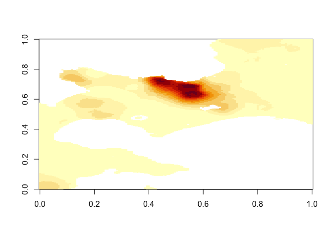
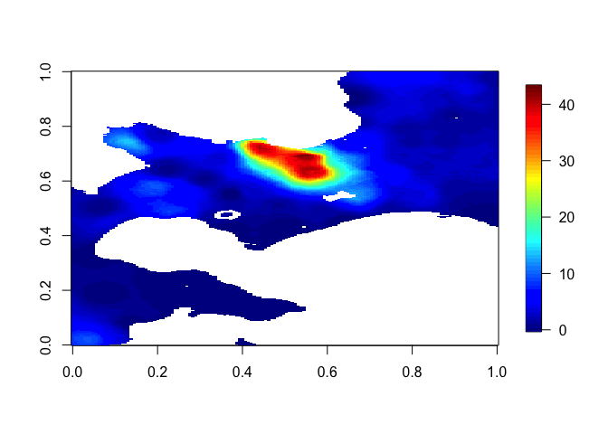
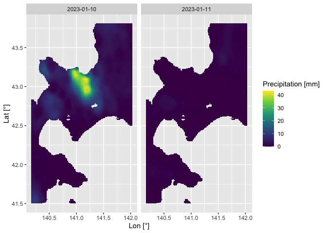
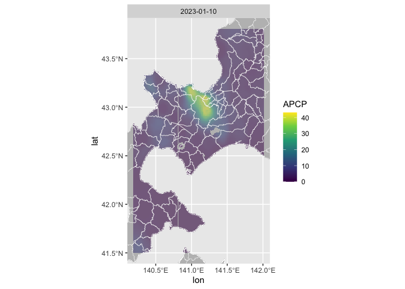
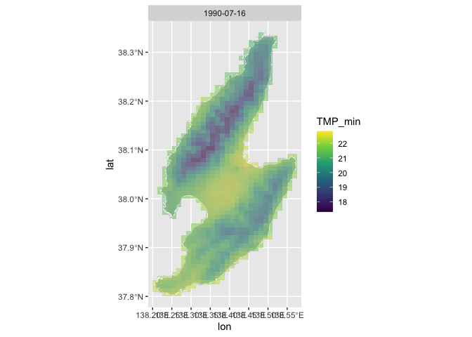
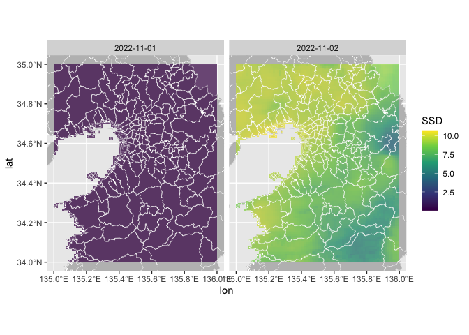

<!-- README.md is generated from README.Rmd. Please edit that file -->

# agrmesh 

このパッケージは農研機構が運営するメッシュ農業気象データシステムをRから利用するためのインターフェイスです。
システム全般に関する情報は[こちら](https://amu.rd.naro.go.jp/wiki_open/doku.php)を参照してください。
Rstudioでの利用を想定しています。 このパッケージはIntel Mac、M2
Mac、Windows 10、Linux (Ubuntu 22.04.1
LTS)で動作することが確認されていますが、とくにAppleCPUのMacではいくつかの依存性パッケージのインストールに苦戦する可能性があります。

## 1. ユーザ登録と初期設定

システムの利用のためには[こちらのページ](https://amu.rd.naro.go.jp/wiki_open/doku.php?id=subscription)からユーザ登録をする必要があります。
事務局から折返し連絡があり次第、以下のRでの作業に入ります。

`agrmesh`パッケージの動作に必要ないくつかのパッケージを先にインストールする必要があります。
`sf`パッケージには動作OSによってはいくつかの事前準備が必要です。
[公式ページ](https://r-spatial.github.io/sf/)を参照し、必要な手続きを終えてから以下のスクリプトをRstudio上で実行してください。

インストール時にエラーが出た場合にはエラーメッセージを確認し、不足を指摘されたパッケージをインストールしたうえで、再度`agrmesh`パッケージのインストールを実施してください。

``` r
install.packages("devtools") # if not installed
install.packages("sf") # shapeデータの利用のため
devtools::install_github("uribo/jpndistrict") # 国内の行政区画データの利用のため

devtools::install_github("KeachMurakami/agrmesh")
```

インストール後に、`library(agrmesh)`を実行し、パッケージを読み込みます。
初回読み込み時に環境設定ファイル (`.Renviron`) が開かれます。
ユーザのR利用状況によっては既に数行分、`XXX=****`のような形式で設定が記入されている場合があります。
末尾に以下のようにIDとパスワードを追記し、保存したのちにRstudioを再起動してください。

    XXXX=****
    YYYY=****
    ZZZZ=****
    amgsds_id=YOURID
    amgsds_pw=YOURPW

この設定を正しく終えると、以降はパッケージの読み込み時に自動的にユーザ認証がされます。
Rstudioを再起動してパッケージを読み込み、以下のようなメッセージが表示されることを確認してください。

``` r
library(tidyverse)
#> ── Attaching core tidyverse packages ──────────────────────── tidyverse 2.0.0 ──
#> ✔ dplyr     1.1.4     ✔ readr     2.1.5
#> ✔ forcats   1.0.0     ✔ stringr   1.5.1
#> ✔ ggplot2   3.4.4     ✔ tibble    3.2.1
#> ✔ lubridate 1.9.3     ✔ tidyr     1.3.1
#> ✔ purrr     1.0.2     
#> ── Conflicts ────────────────────────────────────────── tidyverse_conflicts() ──
#> ✖ dplyr::filter() masks stats::filter()
#> ✖ dplyr::lag()    masks stats::lag()
#> ℹ Use the conflicted package (<http://conflicted.r-lib.org/>) to force all conflicts to become errors
library(jpndistrict)
#> This package provide map data is based on the Digital Map 25000 (Map
#> Image) published by Geospatial Information Authority of Japan (Approval
#> No.603FY2017 information usage <https://www.gsi.go.jp>)
library(agrmesh)
#> ℹ WELCOME to R-AMGSDS interface (ver.0.0.1.2) 
#> ℹ 農研機構は、農業分野や他の分野における研究・開発・教育・試用を目的とする者に、審査に基づきメッシュ農業気象データ（以下、「このデータ」と呼ぶ。）の利用を許可します。
#> ℹ 特に許可されない限り、このデータを他に転載したり第三者に提供したりすることはできません。
#> ℹ このデータを利用して作成した情報を販売することはできません。
#> ℹ 利用者は、利用期間の終了後、速やかに利用報告をすることとします。
#> ℹ 農研機構は、利用者がこのデータの利用によって生じた結果、ならびに、このデータが利用できないことによって生じた結果について、いかなる責任も負いません。
#> ℹ このデータを利用して得た成果等を公表する場合は、「農研機構メッシュ農業気象データ（The Agro-Meteorological Grid Square Data, NARO）」を利用した旨を明記してください。
#> ✔ USERID and PASSWORD -> verified
```

## 2. オンラインでの利用

### 地点データの取得

#### 日別気象データ

札幌と那覇の今日の日平均気温を取得する例は以下の通りです。

``` r
point_daily_temp <-
  fetch_amgsds(
    lats = c(43, 26.2), lons = c(141.4, 127.7),  # 抽出対象の緯度・経度
    elements = "TMP_mea"                         # 抽出対象の気象・地理情報要素
  )

print(point_daily_temp)
#> # A tibble: 2 × 5
#>   time         lat   lon site_id TMP_mea
#>   <date>     <dbl> <dbl> <chr>     <dbl>
#> 1 2024-02-25  43.0  141. 1         -4.69
#> 2 2024-02-25  26.2  128. 2         16.5
```

出力された`point_daily_temp`は、日付 (`time`)、緯度・経度
(`lat`・`lon`)、地点ごとに振られた番号
(`site_id`)、そして取得された気象要素値 (この場合は`TMP_mea`)
からなるデータです。
このパッケージは地点・領域の指定に緯度経度を使います。 google
mapなど各種webサービスで地点の情報を得られます。
Rコンソール上で`find_location()`と打ち込めばRからでも地図を見ながら緯度経度の確認が可能です。

なお、取得されたデータの緯度・経度はユーザが指定した地点を含むメッシュの中心の緯度経度です。
<!-- メッシュの大きさはおよそ1 km 四方なので、数百メートル程度はずれる可能性があります。 -->
取得可能な気象要素とその略称は、Rコンソール上で`preview_dataset("daily")`と打ち込めば確認できます。
より詳細な情報については[こちら](https://amu.rd.naro.go.jp/wiki_open/doku.php?id=about)から確認してください。

上のように`fetch_amgsds`関数はデフォルトでは、指定した地点の今日の日別気象データを取得します。
いくつかの引数を切り替えることで、様々なデータを取得することができます。
`fetch_amgsds`関数の全引数とデフォルト値は以下の通りです。

``` r
fetch_amgsds(
  times = Sys.time(), # 抽出対象の時間範囲
                      #   POSIX系、lubridate系の日付時間関連オブジェクトで指定
                      #       - タイムゾーンが明示されている場合: 日本標準時 (JST) に変換してから処理
                      #       - タイムゾーンが明示されていない場合: 日本標準時 (JST) だとみなして処理
                      #   "2022-01-01", "1999/08/30 03:40"のように年月日が明示される文字列でも一部の関数は機能 (非推奨)
  lats, lons,         # 抽出対象の緯度・経度範囲
                      #   latsとlonsの長さは同一
  elements,           # 抽出対象の気象・地理情報要素
  mode = "point",     # 抽出方式
                      # "point":    緯度・経度地点を含むメッシュの値を出力する
                      # "area":     緯度・経度範囲のメッシュの値を出力する
                      # "complete": 緯度・経度範囲を包含する１次メッシュの値を出力する
  source = "daily",   # データのソース
                      # "daily":    日別データを出力する
                      # "hourly":   時別データを出力する
                      # "scenario": 将来シナリオデータを出力する
                      # "geo":      地理情報データを出力する
  output = "tibble",  # 結果の出力形式
                      # "tibble":   データフレーム形式
                      # "array":    配列形式
                      # "raw":      tidyncパッケージによるnetcdfへのコネクション形式 
  mode = "MIROC5",    # 将来気候データ作成に用いたモデル名
                      # source == "scenario"の場合にのみ有効
  RCP = "RCP8.5",     # 将来気候データ作成に用いた排出シナリオ名
                      # source == "scenario"の場合にのみ有効
  is_clim = FALSE,    # TRUEならば平年値を表示する
  server = "https://amd.rd.naro.go.jp/",
                      # OPeNDAPサーバーのURL
  .silent = TRUE      # FALSEならばダウンロードファイルサイズ等の情報を表示
)
```

#### 時別気象データ

時別気象データを取得したい場合、`source = "hourly"`に変更し、気象要素に応じて`elements = c("TMP", "RH")`のように変更します。

``` r
# 日時データの扱いにはlubridateパッケージが便利です
library(lubridate)

time_range <-
  ymd_hm(c("2023-12-30 13:30", "2024-01-02 22:30"), tz = "Asia/Tokyo") # tzを Asiz/TokyoまたはJapanに指定
  # ymd(c("2023-12-30", "2024-01-02"), tz = "Asia/Tokyo") なら4日間 = 96時間のデータを取得

sites <-
  tibble(
    site = c("Tokyo Tower", "Tokyo Sta.", "Mt. Fuji"),
    lat = c(35.66, 35.68, 35.36),
    lon = c(139.75, 139.77, 138.72)
  )

point_hourly <-
  fetch_amgsds(
    times = time_range,
    lats = sites$lat, lons = sites$lon,
    elements = c("TMP", "RH"),
    source = "hourly"
  )

print(point_hourly)
#> # A tibble: 243 × 6
#>    time                  lat   lon site_id   TMP    RH
#>    <dttm>              <dbl> <dbl> <chr>   <dbl> <dbl>
#>  1 2023-12-30 14:00:00  35.7  140. 1        14.6  41.3
#>  2 2023-12-30 15:00:00  35.7  140. 1        13.7  53.7
#>  3 2023-12-30 16:00:00  35.7  140. 1        12.8  58.5
#>  4 2023-12-30 17:00:00  35.7  140. 1        10.1  65.4
#>  5 2023-12-30 18:00:00  35.7  140. 1         9.7  64  
#>  6 2023-12-30 19:00:00  35.7  140. 1         9.7  65.5
#>  7 2023-12-30 20:00:00  35.7  140. 1         8.9  73.6
#>  8 2023-12-30 21:00:00  35.7  140. 1         8.7  80.1
#>  9 2023-12-30 22:00:00  35.7  140. 1         9    78.6
#> 10 2023-12-30 23:00:00  35.7  140. 1         9.2  81.3
#> # ℹ 233 more rows
```

現在のところ、時別気象要素として、気温 (`TMP`) と相対湿度 (`RH`)
のみがサポートされています。
Rコンソール上で`preview_dataset("hourly")`と打ち込めば取得可能な時間範囲を確認できます。

#### 地理情報データ

地理情報を取得したい場合、`source = "geo"`に変更し、地理要素に応じて`element = "altitude"`のように変更します。

``` r
point_altitude <-
  fetch_amgsds(
    lats = sites$lat, lons = sites$lon,    
    elements = "altitude",                  
    source = "geo"
  )

print(point_altitude)
#> # A tibble: 3 × 5
#>   time    lat   lon site_id altitude
#>   <chr> <dbl> <dbl> <chr>      <dbl>
#> 1 ----   35.7  140. 1              4
#> 2 ----   35.7  140. 2              3
#> 3 ----   35.4  139. 3           3212
```

取得可能な地理要素とその略称はRコンソール上で`preview_dataset("geo")`と打ち込めば確認できます。
より詳細な情報については[こちら](https://amu.rd.naro.go.jp/wiki_open/doku.php?id=geodata)から確認してください。

#### 将来シナリオデータ

将来シナリオデータを取得したい場合、`source = "scenario"`に変更し、気候モデル
(`model`) と排出シナリオ (`RCP`)
を設定し、気象要素に応じて`elements = "TMP_mea"`のように変更します。

``` r

point_scenario <-
  fetch_amgsds(
    times = ymd(c("2070-05-01", "2070-05-10"), tz = "Asia/Tokyo"), 
    lats = sites$lat, lons = sites$lon,
    elements = "TMP_mea",
    source = "scenario",
    model = "CSIRO-Mk3-6-0",
    RCP = "RCP8.5"
  )

print(point_scenario)
#> # A tibble: 30 × 5
#>    time         lat   lon site_id TMP_mea
#>    <date>     <dbl> <dbl> <chr>     <dbl>
#>  1 2070-05-01  35.7  140. 1          20.9
#>  2 2070-05-02  35.7  140. 1          17.5
#>  3 2070-05-03  35.7  140. 1          18.8
#>  4 2070-05-04  35.7  140. 1          20.2
#>  5 2070-05-05  35.7  140. 1          19.0
#>  6 2070-05-06  35.7  140. 1          19.3
#>  7 2070-05-07  35.7  140. 1          19.2
#>  8 2070-05-08  35.7  140. 1          17.0
#>  9 2070-05-09  35.7  140. 1          18.6
#> 10 2070-05-10  35.7  140. 1          22.1
#> # ℹ 20 more rows
```

取得可能な気象要素とその略称はRコンソール上で`preview_dataset("scenario")`と打ち込めば確認できます。
利用可能なモデル、排出シナリオについては[こちら](https://amu.rd.naro.go.jp/wiki_open/doku.php?id=scenalio)から確認してください。

### 空間データの取得と可視化

特定の地点に興味がある場合もありますが、空間分布に興味がある場合もあります。
`mode = "area"`とすると指定された緯度・経度範囲内のメッシュのデータを取得でき、`output = "array"`とすることで、配列データとして出力を受け取ることができます。
出力された`area_daily_rain`は\[緯度, 経度, 時間\]の３次元配列です。
`attributes(area_daily_rain)`から、各次元の情報を得ることができます。

``` r
area_daily_rain <-
  fetch_amgsds(
    times = ymd(c("2023-01-10", "2023-01-11"), tz = "Japan"),
    lats = c(41.5, 43.8), lons = c(140.2, 142.0),
    elements = "APCP",
    mode = "area",
    output = "array"
  )

str(attributes(area_daily_rain))
#> List of 3
#>  $ dim     : int [1:3] 146 277 2
#>  $ axes    :List of 3
#>   ..$ lon : num [1:146] 140 140 140 140 140 ...
#>   ..$ lat : num [1:277] 41.5 41.5 41.5 41.5 41.5 ...
#>   ..$ time: Date[1:2], format: "2023-01-10" "2023-01-11"
#>  $ variable: chr "APCP"
```

標準実装されている`image`関数や、`fields`パッケージの`image.plot`関数で簡単な可視化が可能です。

``` r
image(area_daily_rain[,,1])
```



``` r

# install.packages("fields") # if not installed
library(fields)
#> Loading required package: spam
#> Spam version 2.10-0 (2023-10-23) is loaded.
#> Type 'help( Spam)' or 'demo( spam)' for a short introduction 
#> and overview of this package.
#> Help for individual functions is also obtained by adding the
#> suffix '.spam' to the function name, e.g. 'help( chol.spam)'.
#> 
#> Attaching package: 'spam'
#> The following objects are masked from 'package:base':
#> 
#>     backsolve, forwardsolve
#> Loading required package: viridisLite
#> 
#> Try help(fields) to get started.
image.plot(area_daily_rain[,,1])
```



現在主流な描画パッケージである`ggplot2`を使うとより細かい設定を行うことができます。
fetchする際に`output = "tibble"`としておくか、arrayに`unfold_array`処理をかけると、`ggplot2`に適したlong形式のデータに整形できます。

``` r
area_daily_rain_long <-
  area_daily_rain %>%
  unfold_array()

print(area_daily_rain_long)
#> # A tibble: 38,660 × 4
#>    time         lat   lon  APCP
#>    <date>     <dbl> <dbl> <dbl>
#>  1 2023-01-10  41.5  140.  7.54
#>  2 2023-01-10  41.5  140.  7.90
#>  3 2023-01-10  41.5  140.  8.07
#>  4 2023-01-10  41.5  140.  8.20
#>  5 2023-01-10  41.5  140.  8.24
#>  6 2023-01-10  41.5  140.  8.37
#>  7 2023-01-10  41.5  140.  8.27
#>  8 2023-01-10  41.5  140.  8.30
#>  9 2023-01-10  41.5  140.  7.93
#> 10 2023-01-10  41.5  140.  7.22
#> # ℹ 38,650 more rows
```

`ggplot2`での作図例は以下の通りです。

``` r
library(ggplot2)

area_daily_rain_long %>%
  ggplot(aes(lon, lat, fill = APCP)) +
  geom_tile(width = .05) +
  scale_fill_viridis_c() +
  facet_wrap(~ time) +
  labs(x = "Lon [°]", y = "Lat [°]", fill = "Precipitation [mm]")
```



市町村境界を示した地図と気象情報を重ねたい場合、`plot2d_shape`関数が利用可能です。
表示したい都道府県を`pref_code`にJISコードで与えることで描画地図範囲を設定しています。
この機能には`jpndistrict`パッケージを経由して、国土地理院が提供する「数値地図
25000（地図画像）」を利用しています。
`coord_sf`で適当な描画を設定できます。

``` r
area_daily_rain_long %>%
  plot2d_shape(
    alpha = .5,     # 気象データの透過率
    time_index = 1, # 表示する時間断面
    pref_code = 1:2 # 都道府県番号
  )
#> Warning:
#> 2個の日付・時刻のデータが存在します。`time_index`で指定された1番目のデータのみが表示されています。
```



また、探索的解析では対話的な操作が便利な場合があります。
`plot2d_leaflet`関数は、long形式のデータからズーム等の操作が可能なhtml
widgetを作成します。
`time_index`で何番目の時間のデータを図示するかを選択し、`alpha`で透過率を指定しています。
`basemap = leaflet:::providers$Esri.WorldImagery`などを選択することで、気象情報を衛星写真に重ね合わせることも可能です。
PCの性能と描画領域の大きさによって、Rstudioがクラッシュする場合があります。
そういう場合には、`thin`の値を小さくすることを検討してください。
`thin`を指定しなかった場合には、`thin = 0.01`として領域内のメッシュのうち1
%が表示されるように調整しています。

``` r

# README.mdに掲載できないため、このコードは実行されていません

area_daily_rain_long %>%
  filter(between(lat, 42.7, 43.5), between(lon, 140.5, 141.5)) %>%
  plot2d_leaflet(
    alpha = .5,       # 気象データの透過率
    time_index = 1:3, # 表示する時間断面
    basemap = leaflet:::providers$Wikimedia,
                      # 背景となる地図の種類
    thin = 1          # 描画割合 (0-1)
  )
```

`output = "array"`として複数要素を取得した場合、返り値は要素ごとのリスト形式になっています。
`unfold_array`関数は単一要素のときと同様に作用しますが、`plot2d_***`系の関数を使った場合には警告が表示され、`element_index`で指定した番号の要素に関するデータのみが図示されます。

``` r
area_sado_temps <-
  fetch_amgsds(
    times = ymd(c("1990/07/15", "1990/07/16"), tz = "Japan"),
    lats = c(37.8, 38.4), lons = c(138.2, 138.6),
    elements = c("TMP_max", "TMP_min"),
    mode = "area",
    output = "array"
  )

# 上のコードは以下のコードと等価です
# list(
#   fetch_amgsds(..., element = "TMP_max", ...),
#   fetch_amgsds(..., element = "TMP_min", ...)
#   )

str(area_sado_temps)
#> List of 2
#>  $ : num [1:33, 1:73, 1:2] NA NA NA 25.4 25.3 ...
#>   ..- attr(*, "axes")=List of 3
#>   .. ..$ lon : num [1:33] 138 138 138 138 138 ...
#>   .. ..$ lat : num [1:73] 37.8 37.8 37.8 37.8 37.8 ...
#>   .. ..$ time: Date[1:2], format: "1990-07-15" "1990-07-16"
#>   ..- attr(*, "variable")= chr "TMP_max"
#>  $ : num [1:33, 1:73, 1:2] NA NA NA 22.6 22.5 ...
#>   ..- attr(*, "axes")=List of 3
#>   .. ..$ lon : num [1:33] 138 138 138 138 138 ...
#>   .. ..$ lat : num [1:73] 37.8 37.8 37.8 37.8 37.8 ...
#>   .. ..$ time: Date[1:2], format: "1990-07-15" "1990-07-16"
#>   ..- attr(*, "variable")= chr "TMP_min"

unfold_array(area_sado_temps)
#> # A tibble: 1,918 × 5
#>    time         lat   lon TMP_max TMP_min
#>    <date>     <dbl> <dbl>   <dbl>   <dbl>
#>  1 1990-07-15  37.8  138.    25.4    22.6
#>  2 1990-07-15  37.8  138.    25.3    22.5
#>  3 1990-07-15  37.8  138.    25.4    22.5
#>  4 1990-07-15  37.8  138.    25.5    22.5
#>  5 1990-07-15  37.8  138.    25.3    22.5
#>  6 1990-07-15  37.8  138.    25.2    22.3
#>  7 1990-07-15  37.8  138.    25.2    22.3
#>  8 1990-07-15  37.8  138.    25.2    22.2
#>  9 1990-07-15  37.8  138.    25.4    22.3
#> 10 1990-07-15  37.8  138.    25.5    22.4
#> # ℹ 1,908 more rows

unfold_array(area_sado_temps) %>%
  plot2d_shape(pref_code = 15, element_index = 2, time_index = 2)
#> Warning:
#> 複数の要素のデータが存在します。`element_index`で指定された2番目の要素のみが表示されています。
#> Warning:
#> 2個の日付・時刻のデータが存在します。`time_index`で指定された2番目のデータのみが表示されています。
```



## 3. オフラインでの利用

広範囲・長期間・他要素のデータを扱う場合には、解析の都度データをダウンロードすると時間がかかります。
また、接続が不安定な場合には処理が途中で中断する場合があります。
事前にOPeNDAPからNetCDF形式のファイルをローカル環境に保存しておくことで、必要なときに高速かつ安定的にロードすることができます。

ローカルに保存されたNetCDFデータを読み込むには`load_amgsds`関数を使います。
またこの関数は、`autodownload = TRUE`とすることで、不足しているデータを自動的に`localdir`で指定したフォルダ以下に保存します。
自動ダウンロードの可否 (`autodownload`) と保存先の指定 (`localdir`)
以外は`fetch_amgsds`関数と同様の使い方をします。
ダウンロードされるNetCDFファイルは１次メッシュ単位なので、やや容量が大きくなります。
変動はありますが１要素１年分のデータサイズは、日別で10 MB、時別では120
MB 程度です。

十分なローカル容量がある場合、`fetch_amgsds`関数の代わりに`autodownload = TRUE`として`load_amgsds`関数を使用すれば、適宜必要なデータが蓄積されていきます。
ただし、当日以降のデータ (= 予報値)
は毎日更新される点に注意する必要があります。
**したがって予報値を含む期間を対象とする場合には、十分に関数の挙動を理解している場合を除き`fetch_amgsds`関数の利用を推奨します。**

``` r
args(load_amgsds)
#> function (times = Sys.time(), lats, lons, elements, mode = "point", 
#>     source = "daily", output = "tibble", model = "MIROC5", RCP = "RCP8.5", 
#>     is_clim = FALSE, server = "amd.rd.naro.go.jp", .silent = TRUE, 
#>     localdir, autodownload = FALSE) 
#> NULL
```

``` r
area_photoperiod <-
  load_amgsds(
    times = ymd(c("2022-10-31", "2022-11-05"), tz = "Asia/Tokyo"),
    lats = 34:35, lons = 135:136,
    elements = "SSD",
    mode = "area",
    output = "array",
    
    localdir = "~/amd_working/",  # 保存先フォルダ
    autodownload = TRUE           # 自動ダウンロードを許可
  )
#> ℹ SSDのNetCDFファイルをOPeNDAPサーバからダウンロードします。


area_photoperiod %>%
  unfold_array() %>%
  plot2d_shape(time_index = 2:3, alpha = .7, pref_code = 26:30)
#> Warning:
#> 6個の日付・時刻のデータが存在します。`time_index`で指定された2-3番目のデータのみが表示されています。
```



`load_amgsds`関数はNetCDFファイルのダウンロードと読み込み・表示を行うのでやや挙動が遅い関数です。
まとまったオフライン作業のために予めNetCDFファイルのダウンロードのみを行いたい場合、以下の手続きをとってください。

まず、`generate_path`関数を使って、OPeNDAPのファイルパスを作成します。

``` r
paths <-
  generate_path(
    times = ymd(c("2021-01-01", "2021-12-31"), tz = "Asia/Tokyo"),
    lats = c(44, 45),
    lons = c(143, 144),
    element = "TMP_mea",
    source = "daily",
    is_clim = FALSE
    )
```

次に、`download_netcdf`関数でNetCDFファイルをダウンロードします。
基本的には、上で作成した`paths`のうち、１次メッシュ全体を指す`paths$complete`をダウンロードします。
`outdir`で指定したフォルダ以下にOPeNDAPと同様のフォルダ構成が自動的に構築され、NetCDFファイルが保存されます。

``` r
download_netcdf(amgsds_path = paths$complete, outdir = "~/amd_working", .silent = FALSE)
```

この例では、

- `~/amd_working/AMD/2021/AMDy2021p6643eTMP_mea.nc.nc`
- `~/amd_working/AMD/2021/AMDy2021p6644eTMP_mea.nc.nc`
- …
- `~/amd_working/AMD/2021/AMDy2021p6744eTMP_mea.nc.nc`

のような構造でファイルがダウンロードされます。
１次メッシュ内に陸地が含まれない場合にはNetCDFファイルは存在せず、ダウンロード処理も実施されません。

どうしても容量を削減したい場合には、`amgsds_path = paths$point`あるいは`amgsds_path = paths$area`とすることで、１次メッシュ全体ではなく指定した地点・範囲のデータのみをダウンロードできます。
この場合、ご自分でNetCDFファイルを読み込むRあるいはその他言語のプログラムを作成してください。
Rでは、`tidync`、`ncdf4`、`raster`、`metR1`、`RNetCDF`、`easyNCDF`などのパッケージでNetCDFを扱うことが可能です。
本パッケージでは`tidync`を利用しています。

## 4. その他

パッケージの利用に関して不明な点や機能の追加のリクエストがある場合には、slackの技術相談窓口にてお問い合わせください。
本パッケージは[GNU General Public
License](https://www.gnu.org/licenses/gpl-3.0.html) version 3 or later
を継承します。
また、jpndistrictパッケージが提供する行政区画データを利用する場合は、適切に出典を表記するようにしてください。

Copyright 2023 Keach Murakami

## 5 変更履歴

- 2023-05-23 (ver. 0.0.1.0000)
  - パッケージを公開しました。
- 2024-01-23 (ver. 0.0.1.0001)
  - 複数年に跨るデータの取得が可能になりました。
  - データ取得の接続先を任意のOPeNDAPサーバに変更できるようにしました。
- 2024-01-23 (ver. 0.0.1.0002)
  - {leaflet}の更新に対応し、`plot2d_leaflet`時の背景地図を変更しました。
- 2024-02-25 (ver. 0.0.1.0003)
  - 取得可能な時別データのリストを更新しました。

<!-- ## 4. 実践的な使用例 -->
<!-- いくつかの実践的なサンプルを示します。 -->
<!-- #### 4.1 有効積算気温マップの作成 -->
<!-- 作物の発育を考える場合、一定の閾値以上の気温の累積値が重要となります。 -->
<!-- 以下の式で表される有効積算気温という考え方が利用されています。 -->
<!-- $$ -->
<!-- 有効積算気温 = \sum_i {\left( \max( \textrm{TMP}_\textrm{mea, i} - \textrm{TMP}_\textrm{base}, 0)\right) }, -->
<!-- $$ -->
<!-- ここで`TMPmea`は日平均気温のメッシュ値、`TMPbase`は基準温度と呼ばれる閾値です。 -->
<!-- ```{r} -->
<!-- growth_season_temperature <- -->
<!--   fetch_amgsds(times = c("2023-04-01", "2023-10-30"), -->
<!--                lats = c(43, 44), lons = c(142, 143), element = "TMP_mea", -->
<!--                mode = "area", output = "array") -->
<!-- ``` -->
<!-- `apply`関数は`MARGIN`で指定した次元に対して`FUN`で指定した関数を適用する関数です。 -->
<!-- 以下スクリプトで時間軸に対して0度以上の日平均気温の積算値を計算します。 -->
<!-- ```{r} -->
<!-- apply(growth_season_temperature, MARGIN = 1:2, FUN = function(x) sum(pmax(x, 0))) -->
<!-- ``` -->
<!-- #### 4.2 気象指標の計算 -->
<!-- 一般に作物の光合成量は日射量に応じて増加しますが、気温が適温から外れると増加量は小さくなります。 -->
<!-- いくつかの地域で日平均気温と日射量に基づいて光合成量を計算してみます。 -->
<!-- 仮に日光合成量 P を以下の式で計算できるものとします。 -->
<!-- $$ -->
<!-- P = \max\left(0, \dfrac{\textrm{GSR}}{| \textrm{TMP}_\textrm{mea} - 25|}\right), -->
<!-- $$ -->
<!-- ここでGSRは日積算日射量のメッシュ値、TMPmeaは日平均気温のメッシュ値です。 -->
<!-- ```{r} -->
<!-- groth_season_temperature <- -->
<!--   fetch_amgsds(times = c("2023-04-01", "2023-10-30"), -->
<!--                lats = c(), lons = c(), element = "TMP_mea") -->
<!-- ``` -->
